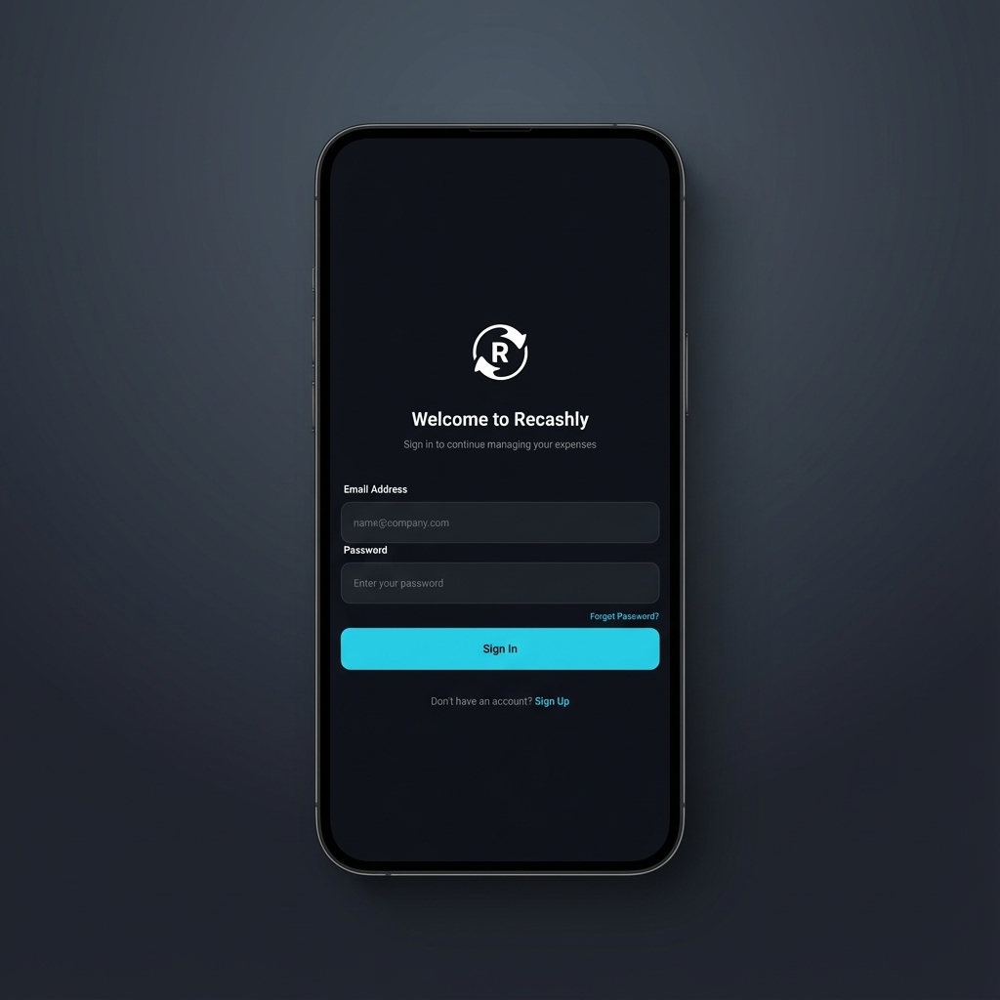
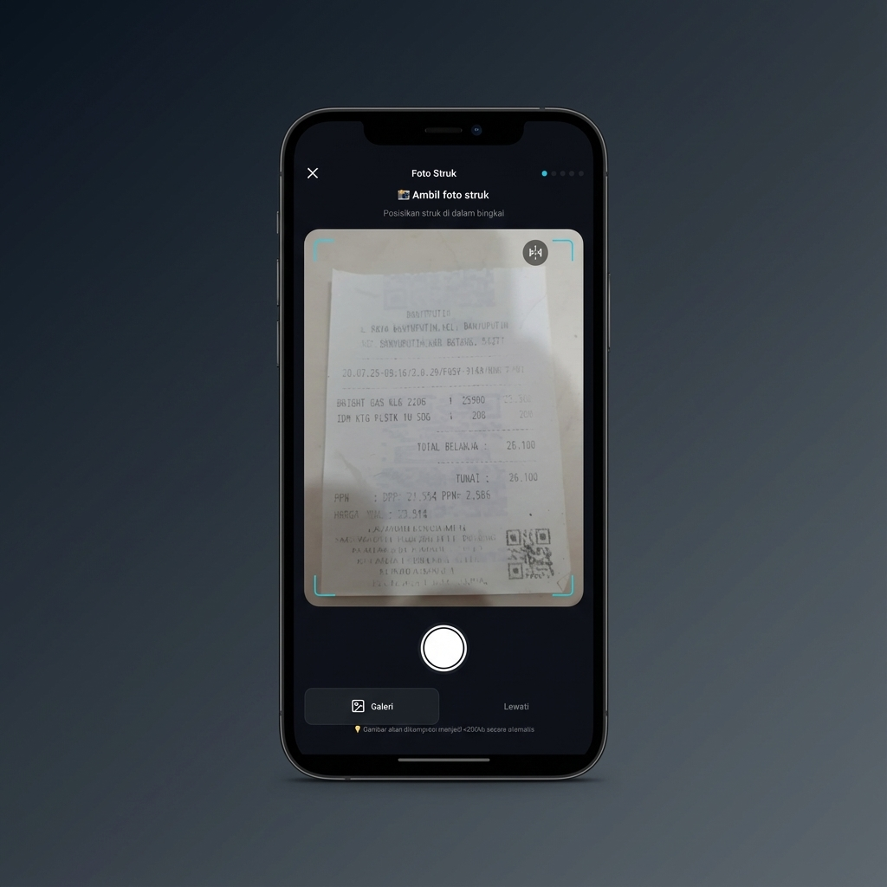
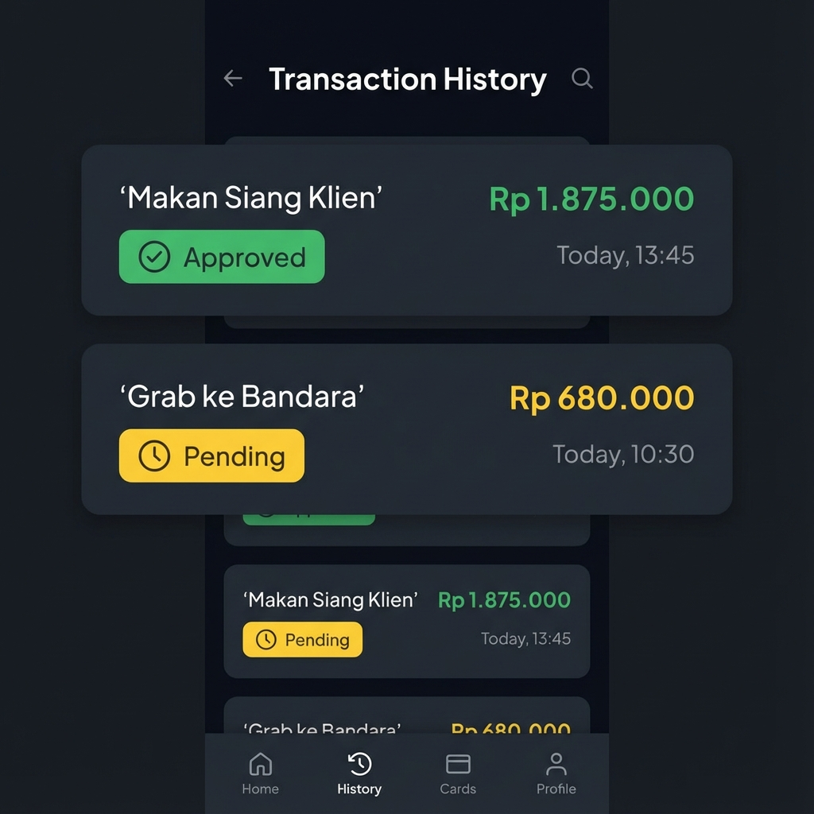

# 📱 Recashly Mobile

[](https://opensource.org/licenses/MIT)

[English](#-english) | [Bahasa Indonesia](#-bahasa-indonesia)

---

## 🇺🇸 English

> **Official Mobile Application for [Recashly Backend](https://github.com/adydhermawan/ReimburseBackend).**
> Built for speed, reliability in poor network conditions, and seamless background syncing.

### 🚀 Overview

Recashly solves the "lost receipt" problem for field teams. Unlike standard form apps, it is engineered to handle thousands of records locally and sync silently when connectivity returns.

#### Key Capabilities

- **📡 Offline-First Architecture**: Powered by **WatermelonDB**, enabling full functionality without internet.
- **⚡ Smart Image Compression**: Receipts are compressed on-device (<200kb) in a background thread.
- **🔍 Instant Client Search**: "Local-first" client database with <16ms autocomplete.
- **📊 Status Tracking**: Granular tracking from *Draft* → *Uploading* → *Submitted* → *Approved*.

### 📸 Screenshots

| Login | Home | Camera | History |
|:---:|:---:|:---:|:---:|
|  |  |  |  |

### 🛠 Tech Stack

| Component | Technology | Description |
|---|---|---|
| **Framework** | **[Expo](https://expo.dev/) (SDK 52)** | React Native Production Framework. |
| **Routing** | **[Expo Router](https://docs.expo.dev/router/introduction/)** | File-based routing system. |
| **Database** | **[WatermelonDB](https://nozbe.github.io/WatermelonDB/)** | High-performance offline SQLite sync. |
| **State** | **[Zustand](https://github.com/pmndrs/zustand)** | Minimalist global state management. |
| **Styling** | **[NativeWind](https://www.nativewind.dev/)** | Tailwind CSS for React Native. |
| **Icons** | **[Lucide](https://lucide.dev/)** | Consistent, crisp iconography. |

### 📂 Project Structure

```bash
/app                # Expo Router pages (screens)
/components         # Reusable UI components
  /ui               # Low-level atoms (buttons, inputs)
  /forms            # Complex form molecules
/database           # WatermelonDB setup
  /model            # Database Tables (Models)
  /schema.ts        # Database Schema
/services           # API & Sync logic
  /sync.ts          # Synchronization engine
/store              # Zustand stores
```

### 🚀 Getting Started

#### Prerequisites
- [Node.js](https://nodejs.org/) (LTS)
- [Expo Go](https://expo.dev/client) on your device.

#### Installation

1. **Clone & Install**
   ```bash
   git clone https://github.com/your-username/recashly-mobile.git
   cd recashly-mobile
   npm install
   ```

2. **Environment Variables**
   Create `.env` file:
   ```env
   EXPO_PUBLIC_API_URL=http://your-backend-ip:8000/api
   ```

3. **Run Development Server**
   ```bash
   npx expo start
   ```
   *Press `s` to switch between Expo Go and Development Build.*

### 📱 Offline Data Sync

This app uses a custom sync engine compatible with the backend's "Soft Delete" strategy.
- **Push**: Uploads `created` and `updated` records since last pull.
- **Pull**: Downloads `created`, `updated`, and `deleted` records from server.

### 🤝 Contributing

We use **Conventional Commits**. Please run `npm run lint` before submitting PRs.

### 📄 License

MIT License.

---

## 🇮🇩 Bahasa Indonesia

> **Aplikasi Seluler Resmi untuk [Recashly Backend](https://github.com/adydhermawan/ReimburseBackend).**
> Dibangun untuk kecepatan, keandalan dalam kondisi jaringan yang buruk, dan sinkronisasi latar belakang yang mulus.

### 🚀 Ringkasan

Recashly memecahkan masalah "struk hilang" untuk tim lapangan. Tidak seperti aplikasi formulir standar, aplikasi ini dirancang untuk menangani ribuan catatan secara lokal dan menyinkronkannya secara diam-diam saat konektivitas kembali.

#### Kemampuan Utama

- **📡 Arsitektur Offline-First**: Didukung oleh **WatermelonDB**, memungkinkan fungsionalitas penuh tanpa internet.
- **⚡ Kompresi Gambar Cerdas**: Struk dikompresi di perangkat (<200kb) dalam thread latar belakang.
- **🔍 Pencarian Klien Instan**: Basis data klien "Local-first" dengan pelengkapan otomatis <16ms.
- **📊 Pelacakan Status**: Pelacakan terperinci mulai dari *Draf* → *Mengunggah* → *Terkirim* → *Disetujui*.

### 📸 Tangkapan Layar (Screenshots)

| Login | Beranda | Kamera | Riwayat |
|:---:|:---:|:---:|:---:|
|  |  |  |  |

### 🛠 Teknologi yang Digunakan (Tech Stack)

| Komponen | Teknologi | Deskripsi |
|---|---|---|
| **Framework** | **[Expo](https://expo.dev/) (SDK 52)** | Framework React Native untuk Produksi. |
| **Routing** | **[Expo Router](https://docs.expo.dev/router/introduction/)** | Sistem routing berbasis file. |
| **Database** | **[WatermelonDB](https://nozbe.github.io/WatermelonDB/)** | Sinkronisasi SQLite offline performa tinggi. |
| **State** | **[Zustand](https://github.com/pmndrs/zustand)** | Manajemen state global yang minimalis. |
| **Styling** | **[NativeWind](https://www.nativewind.dev/)** | Tailwind CSS untuk React Native. |
| **Ikon** | **[Lucide](https://lucide.dev/)** | Ikonografi yang konsisten dan tajam. |

### 📂 Struktur Proyek

```bash
/app                # Halaman Expo Router (layar)
/components         # Komponen UI yang dapat digunakan kembali
  /ui               # Atom tingkat rendah (tombol, input)
  /forms            # Molekul formulir kompleks
/database           # Pengaturan WatermelonDB
  /model            # Tabel Database (Model)
  /schema.ts        # Skema Database
/services           # Logika API & Sinkronisasi
  /sync.ts          # Mesin sinkronisasi
/store              # Penyimpanan (Stores) Zustand
```

### 🚀 Memulai (Getting Started)

#### Prasyarat
- [Node.js](https://nodejs.org/) (LTS)
- [Expo Go](https://expo.dev/client) di perangkat Anda.

#### Instalasi

1. **Clone & Install**
   ```bash
   git clone https://github.com/your-username/recashly-mobile.git
   cd recashly-mobile
   npm install
   ```

2. **Variabel Lingkungan**
   Buat file `.env`:
   ```env
   EXPO_PUBLIC_API_URL=http://your-backend-ip:8000/api
   ```

3. **Jalankan Server Pengembangan**
   ```bash
   npx expo start
   ```
   *Tekan `s` untuk beralih antara Expo Go dan Development Build.*

### 📱 Sinkronisasi Data Offline

Aplikasi ini menggunakan mesin sinkronisasi kustom yang kompatibel dengan strategi "Soft Delete" backend.
- **Push**: Mengunggah catatan yang `dibuat` dan `diperbarui` sejak penarikan (pull) terakhir.
- **Pull**: Mengunduh catatan yang `dibuat`, `diperbarui`, dan `dihapus` dari server.

### 🤝 Berkontribusi

Kami menggunakan **Conventional Commits**. Harap jalankan `npm run lint` sebelum mengirimkan PR.

### 📄 Lisensi

Lisensi MIT.
